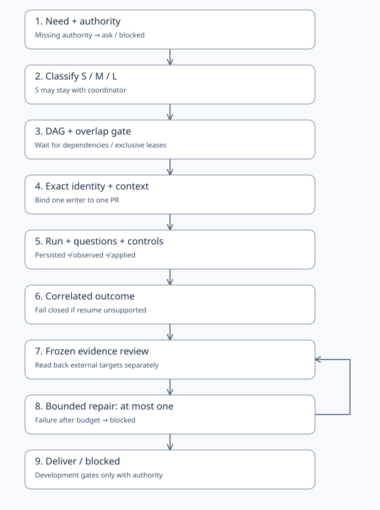

# Relvo Agent Workflow

**Skills-first toolkit for verifiable multi-agent collaboration.**

v0.1 Draft: five portable, single-responsibility skills, JSON Schema contracts,
an offline semantic validator and executable positive/negative examples. Adopt the
working discipline with one tool or several; small tasks do not require multiple agents.

This is **not** a workflow engine, runtime, security sandbox or replacement for A2A.
Hermes, Codex and Claude Code are target consumers, not verified integrations.
The local validator checks submitted claims; it never runs embedded commands,
reads live external state, enforces process locks or proves evidence authenticity.

## Five-minute local success path

Requires Python 3.11+ and [uv](https://docs.astral.sh/uv/) (or pip in an existing venv).
Until the Draft PR is merged, clone its working branch explicitly:

```sh
git clone --branch feat/v0.1-skills-foundation https://github.com/relvo-labs/agent-workflow.git
cd agent-workflow
uv venv --python python3 .venv
uv pip sync --python .venv/bin/python requirements.txt
.venv/bin/python tools/validate.py examples/happy-path.json
.venv/bin/python -m unittest discover -s tests -v
```

The validator prints `VALID: offline contract checks passed; external state not verified`.
The tests also require each invalid fixture to fail for its expected diagnostic.
For a delivered read-only task with one coordinator and no Git/PR/candidate fields,
validate [nonrepo-delivered.json](examples/nonrepo-delivered.json).
Try `.venv/bin/python tools/validate.py examples/stale-evidence.json`: exit 1,
`INVALID: stale-evidence`. Examples are deterministic synthetic data, **not live evidence**.
Windows uses `.venv/Scripts/python.exe`; only Linux execution is verified for this Draft.

## Adopt in another project

Keep the **complete toolkit checkout**. Run:

```sh
.venv/bin/python tools/adopt.py --target /absolute/path/to/your/project --probe
```

Give the agent the resulting local `.agent-workflow/ADOPTION.md` and selected skill.
It names absolute skill/tool paths and works independently of the project's cwd.
No global profile is changed. No native auto-install is claimed. See the precise
[adoption contract](adapters/adoption.md) and [capability matrix](adapters/README.md).

## Choose a skill

| Skill | Responsibility |
|---|---|
| [task-intake](skills/task-intake/SKILL.md) | Request, authority, classification, acceptance |
| [dag-coordinate](skills/dag-coordinate/SKILL.md) | Dependencies, resource/write overlap, activation |
| [writer-handoff](skills/writer-handoff/SKILL.md) | Exact writer ownership and safe transfer |
| [runtime-checkpoint](skills/runtime-checkpoint/SKILL.md) | Questions, controls and truthful runtime state |
| [evidence-review](skills/evidence-review/SKILL.md) | Correlated evidence, bounded repair and closure |



[Workflow specification](spec/workflow.md) · [Schemas](schemas/0.1/) ·
[Fixtures](examples/manifest.json) · [Team profile](profiles/default.json)

## Boundaries and maintenance

Contracts are pre-release and may change. The hardcoded 0.1 checks are a baseline,
not an executable team policy engine. One writer is governance, not an OS mutex;
queue cancellation is not zero processes; persisted ≠ observed ≠ applied; configured
model ≠ native resolved model. Unsupported resume fails closed. One repair is the
maximum; unresolved work stops blocked. Ready does not authorize merge.

No hosted workflow is installed; tests run locally. No release, provider probe,
Windows/macOS test, distributed ledger or production security audit is claimed.
See [contributing](CONTRIBUTING.md), [security](SECURITY.md),
[maintenance](MAINTENANCE.md), [provenance](PROVENANCE.md) and [Apache-2.0](LICENSE).

### 繁中快速開始

執行上方 quickstart 可驗證契約、正反例與 skills 結構。採用時保留完整 toolkit
checkout，再用 `tools/adopt.py --target ... --probe` 產生明示路徑文件；勿單獨複製
SKILL.md。Hermes/Codex/Claude Code 尚未實跑整合，VALID 不代表外部狀態已驗證，
也不代表可 merge。剩餘問題應明示 blocked，不無限重試。
